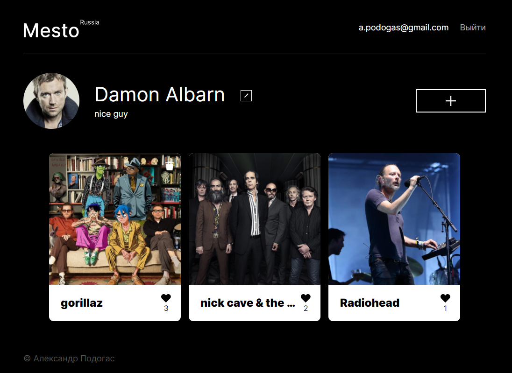

# [mesto.podogas.com](https://mesto.podogas.com/ "Mesto")

## Description:
This was the third training project of Yandex practicum courses.
This is SPA created with React. 
In this app you can sign up/in, add photos, edit profile name and avatar, view and like photos posted from other users.

## In this project I was using following technologies and methods:
####  Jsx markup
####  Adaptive layout
####  React
       react-router
       Linter
       prop-types
       user context
       react hooks
       jwt
       REST API
####  Express
       Express router
       Helmet
       limiter
       Validation via celebrate
       Logging middleware
       Authorization middleware
####  MongoDB
        Compass
####  NodeJs
####  Nginx
####  Postman
